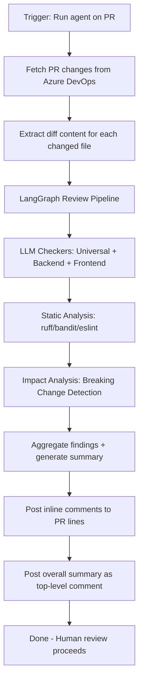
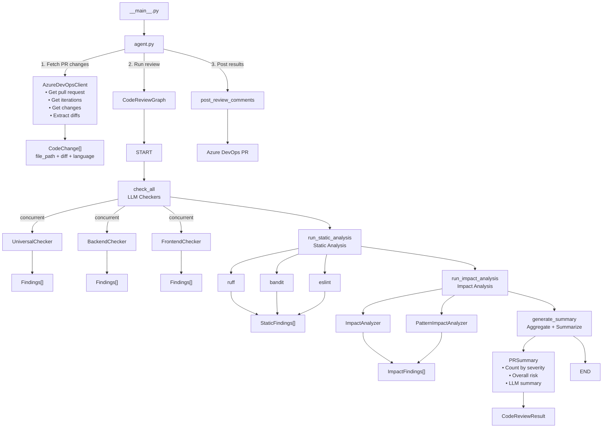
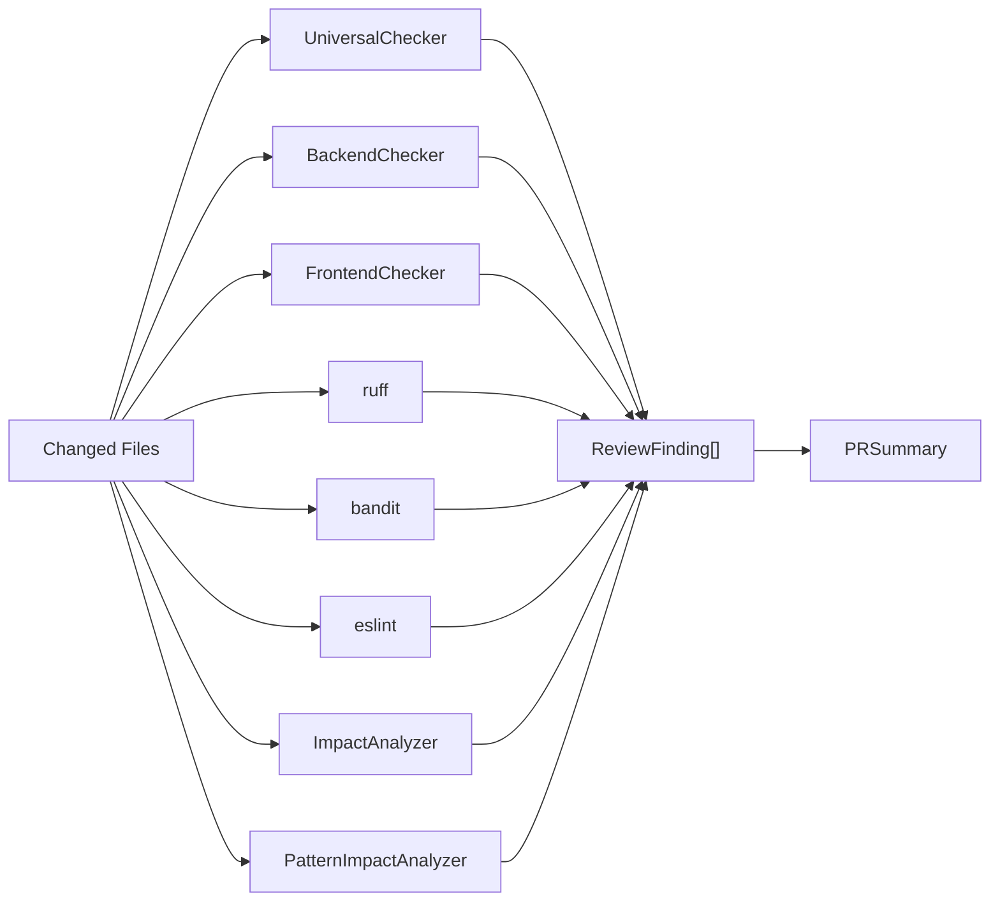

# code-review-agent

AI-powered code review agent integrated with Azure DevOps, supporting multiple LLM providers (Gemini/OpenAI/Anthropic). Automates code quality inspection for backend and frontend code.

## Features

### Universal Code Checks
- **Correctness**: Detects logic errors, edge case gaps, missing error handling
- **Security**: Identifies injection risks, authentication/authorization gaps, exposed secrets, unsafe API usage
- **Maintainability**: Flags excessive complexity, poor naming, code duplication, tight coupling
- **Tests**: Catches missing test coverage, weak assertions, broken assumptions

### Backend Specific Checks
- API contract consistency and breaking changes detection
- Data access issues (N+1 queries, missing indexes, transaction problems)
- Performance & scalability risks (blocking calls, heavy loops)
- Observability gaps (missing logs/metrics, improper retries/timeouts)

### Frontend Specific Checks
- State & async issues (race conditions, unnecessary re-renders)
- Accessibility problems (missing semantic HTML, ARIA issues, keyboard navigation gaps)
- Performance issues (large bundle size, unnecessary renders)
- Client-side security risks (XSS vulnerabilities, unsafe DOM usage)

### Static Analysis Integration
- **Python**: ruff (linting), bandit (security)
- **JavaScript/TypeScript**: eslint
- Deterministic detection of known patterns

### Impact Analysis
- Detects breaking changes (deleted functions/classes)
- Pattern-based impact detection
- AST-based call chain analysis (for Python)

### Azure DevOps Workflow Integration
- Inline PR comments with severity classification (critical > major > minor)
- PR-level risk summary explaining what changed and why it matters
- Supports learning and enforcing team-specific standards from past PRs
- Acts as a first-pass reviewer, never auto-approves

## Configuration

Copy `.env.example` to `.env` and set your:
- Azure DevOps credentials
- LLM provider API key (choose one or more)
- Team-specific rules configuration

## Installation

```bash
uv sync
```

## Usage

### Run as CLI tool

```bash
# Activate virtual environment
source .venv/bin/activate

# Run code review on a pull request
python -m code_review_agent --project <your-project> --repository <repository-id> --pr-id <pr-number>
```

Example:
```bash
python -m code_review_agent --project code_agent --repository ecb5e9be-f3be-4a93-8fe0-83b893641a04 --pr-id 2
```

## Workflow

### Overall Agent Flow



### Full System Architecture



### Code Review Pipeline Detail



### Detection Types by Analyzer

| Analyzer | Detection Type | Examples |
|----------|----------------|----------|
| **UniversalChecker** | Logic errors, missing error handling, exposed secrets, complexity | Hardcoded passwords, null pointer risks |
| **BackendChecker** | N+1 queries, missing indexes, transaction issues, observability gaps | Unpaginated DB queries, missing retries |
| **FrontendChecker** | Race conditions, XSS, accessibility issues, re-renders | Unsafe DOM usage, missing ARIA |
| **StaticAnalyzer** | Known code patterns (via linters) | Style violations, security hotspots |
| **ImpactAnalyzer** | Breaking changes, deleted APIs | Removed public methods, changed signatures |

### Parallel Execution Architecture

The system uses `ThreadPoolExecutor` for two levels of parallelism:

1. **Checker-level parallelism**: All 3 checkers (Universal, Backend, Frontend) run concurrently
2. **File-level parallelism**: Each checker processes multiple files in parallel (default 10 workers)

```python
# In graph.py - Checker parallelism
with ThreadPoolExecutor(max_workers=3) as pool:
    universal_future = pool.submit(run_checker, self.universal_checker, changes)
    backend_future = pool.submit(run_checker, self.backend_checker, changes)
    frontend_future = pool.submit(run_checker, self.frontend_checker, changes)

# In base_checker.py - File parallelism
def check_batch(self, changes: List[CodeChange]) -> List[ReviewFinding]:
    with ThreadPoolExecutor(max_workers=10) as executor:
        results = list(executor.map(self.check, changes))
```

### LangGraph State & Checkers

**Graph State (`ReviewState`)**:
- `pr_id`: Pull request ID
- `repository`: Repository ID
- `changes`: List of changed files with diff
- `universal_findings`: Findings from UniversalChecker
- `backend_findings`: Findings from BackendChecker
- `frontend_findings`: Findings from FrontendChecker
- `summary`: Final PR summary with risk assessment
- `completed`: Completion flag

**Checker Responsibilities**:

| Checker | Scope | What it checks |
|---------|-------|----------------|
| `UniversalChecker` | All code | Correctness, logic errors, missing error handling, security issues, complexity, naming, duplication, exposed secrets |
| `BackendChecker` | Backend code (.py, .java, .go, .js, .ts, .rb, .php, .cs, .cpp) | API contract consistency, N+1 queries, missing indexes, transaction issues, performance blocking calls, observability gaps, retries/timeouts |
| `FrontendChecker` | Frontend code (.js, .jsx, .ts, .tsx, .vue, .svelte, .html, .css, .scss, .less, .astro) | State race conditions, unnecessary re-renders, accessibility, XSS vulnerabilities, bundle size issues |

Each checker runs independently, can add zero or more findings, and findings are accumulated through the graph pipeline.

## Project Structure

```
code-review-agent/
├── src/code_review_agent/
│   ├── __main__.py          # CLI entry point
│   ├── agent.py             # Top-level review orchestration
│   ├── graph.py             # LangGraph definition (CodeReviewGraph)
│   ├── models.py            # Data models (CodeChange, Finding, PRSummary...)
│   ├── standards.py         # Team coding standards injection
│   ├── llm_config.py         # LLM provider configuration
│   ├── checkers/             # LLM-based code checkers
│   │   ├── __init__.py
│   │   ├── base_checker.py       # Base checker with file batching
│   │   ├── universal_checker.py  # Universal checks (all languages)
│   │   ├── backend_checker.py    # Backend-specific checks
│   │   └── frontend_checker.py   # Frontend-specific checks
│   ├── analyzers/            # Static & impact analysis
│   │   ├── __init__.py
│   │   ├── static_analyzer.py    # ruff, bandit, eslint integration
│   │   └── impact_analyzer.py     # Breaking change detection
│   ├── integrations/
│   │   └── azure_devops.py  # Azure DevOps API client
├── tests/                   # Test suite
│   ├── test_data/
│   │   └── golden_dataset.py  # Known issues for validation
│   ├── test_static_analyzer.py
│   ├── test_impact_analyzer.py
│   └── test_analyzer_integration.py
├── docs/                    # MkDocs documentation
├── pyproject.toml
├── uv.lock
└── README.md
```

## Environment Variables

| Variable | Description | Required |
|----------|-------------|----------|
| `AZURE_DEVOPS_ORG_URL` | Azure DevOps organization URL | Yes |
| `AZURE_DEVOPS_PAT` | Personal Access Token with code read/write permissions | Yes |
| `LLM_PROVIDER` | `openai` \/ `gemini` \/ `anthropic` | Yes |
| `LLM_API_KEY` | API key for your LLM provider | Yes |
| `LLM_MODEL` | Model name (optional, uses provider default if not set) | No |

## Notes on Azure DevOps SDK Compatibility

This project currently works with **azure-devops 7.1.0b4** (beta). Breaking changes in the preview SDK have been adapted in code:
- `change.item` is now accessed from `additional_properties`
- `change.change_type` renamed to `changeType`
- `create_pull_request_thread` renamed to `create_thread`

If you encounter further API errors, check the SDK version and update compatibility layer in `azure_devops.py`.

## License

MIT
