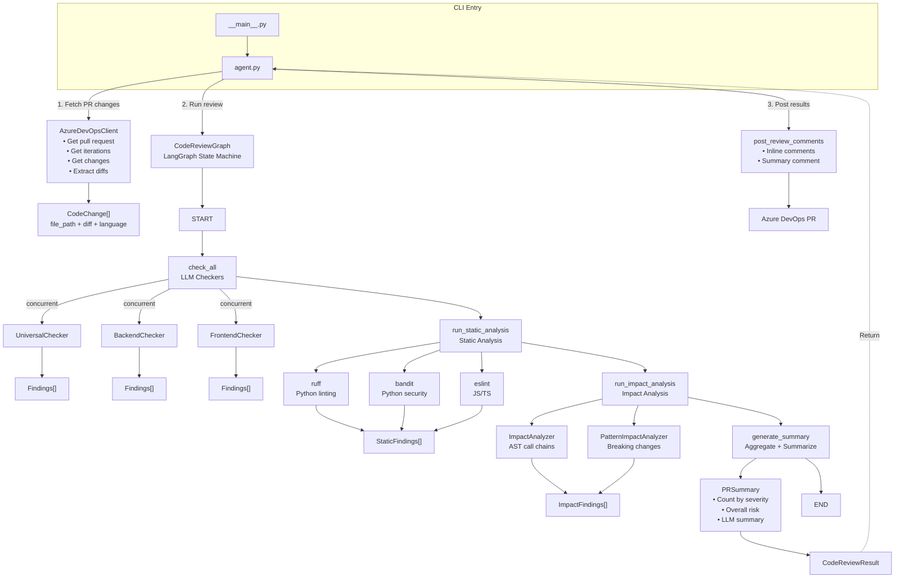
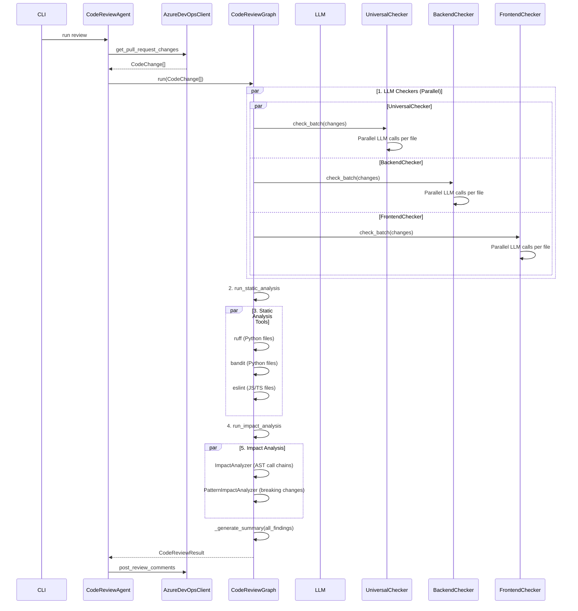
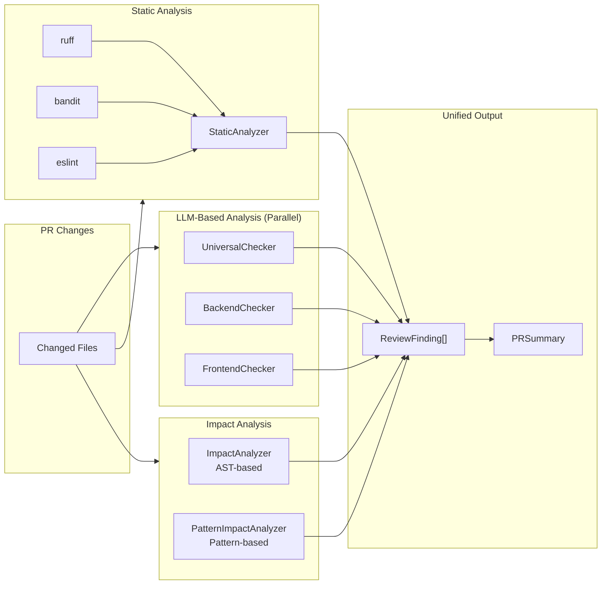

# Architecture

This document describes the high-level architecture of `code-review-agent`.

## Overview

`code-review-agent` is an AI-powered code review tool integrated with Azure DevOps, built on top of LangGraph for orchestration and supports multiple LLM providers. It features **parallel execution** at both the checker level and file level for optimal performance.

## System Architecture



## Parallel Execution

The system uses `ThreadPoolExecutor` for two levels of parallelism:

### 1. Checker-level Parallelism

All 3 checkers run concurrently in the `_check_all_parallel` node:

```python
# graph.py
with ThreadPoolExecutor(max_workers=3) as pool:
    universal_future = pool.submit(run_checker, self.universal_checker, changes)
    backend_future = pool.submit(run_checker, self.backend_checker, changes)
    frontend_future = pool.submit(run_checker, self.frontend_checker, changes)
```

### 2. File-level Parallelism

Each checker processes multiple files in parallel using `check_batch`:

```python
# base_checker.py
def check_batch(self, changes: List[CodeChange]) -> List[ReviewFinding]:
    with ThreadPoolExecutor(max_workers=10) as executor:
        results = list(executor.map(self.check, changes))
```

## LangGraph State

The entire review pipeline shares a single state object:

```python
class ReviewState(TypedDict):
    pr_id: str                       # Pull request ID
    repository: str                  # Repository ID
    changes: List[CodeChange]        # Changed files with diff content
    universal_findings: List[ReviewFinding]  # Findings from UniversalChecker
    backend_findings: List[ReviewFinding]   # Findings from BackendChecker
    frontend_findings: List[ReviewFinding]  # Findings from FrontendChecker
    static_findings: List[ReviewFinding]     # Findings from Static Analysis
    impact_findings: List[ReviewFinding]     # Findings from Impact Analysis
    summary: Optional[PRSummary]     # Final summary generated at the end
    completed: bool                  # Completion flag
```

## Checker Responsibilities

| Checker | Scope | What it checks |
|---------|-------|----------------|
| `UniversalChecker` | All code | Correctness, logic errors, missing error handling, security issues, complexity, naming, duplication, exposed secrets |
| `BackendChecker` | Backend code (.py, .java, .go, .js, .ts, .rb, .php, .cs, .cpp) | API contract consistency, N+1 queries, missing indexes, transaction issues, performance blocking calls, observability gaps, retries/timeouts |
| `FrontendChecker` | Frontend code (.js, .jsx, .ts, .tsx, .vue, .svelte, .html, .css, .scss, .less, .astro) | State race conditions, unnecessary re-renders, accessibility, XSS vulnerabilities, bundle size issues |

Each checker runs independently, can add zero or more findings, and findings are accumulated through the graph pipeline.

## Data Models

| Model | Purpose |
|-------|---------|
| `CodeChange` | Holds file path, diff content, detected language, change type (new/deleted/modified) |
| `ReviewFinding` | Single finding: title, description, severity, category, file_path, line numbers, suggestion |
| `PRSummary` | Aggregated summary: overall risk, count by severity, key concerns, natural language summary |
| `CodeReviewResult` | Final result container: PR ID + all changes + all findings + summary |

## Azure DevOps SDK Compatibility

This project uses `azure-devops 7.1.0b4` (beta preview). The SDK has breaking changes compared to stable versions:

- `change.item` is now stored in `change.additional_properties['item']`
- `change.change_type` renamed to `change.additional_properties['changeType']`
- `git_client.create_pull_request_thread()` renamed to `git_client.create_thread()`
- Inline comments use `CommentThreadContext` and `CommentPosition` SDK objects

All adaptations are handled in `src/code_review_agent/integrations/azure_devops.py`.

## Entry Flow

1. **CLI**: `python -m code_review_agent --project <project> --repository <repo> --pr-id <id>`
2. **CodeReviewAgent.review_pull_request()**
   - Creates AzureDevOpsClient, fetches all changes
   - Initializes LangGraph and runs pipeline
   - Posts comments back to Azure DevOps
   - Returns result
3. Done.

## Sequence Diagram



## Analyzer Pipeline



## Analyzer Components

### Static Analysis (`analyzers/static_analyzer.py`)

Integrated static analysis tools:

| Tool | Language | What it checks |
|------|----------|----------------|
| `ruff` | Python | Linting, code style, complexity |
| `bandit` | Python | Security vulnerabilities |
| `eslint` | JavaScript/TypeScript | Code style, potential bugs |

Features:
- Auto-detects available tools on the system
- Converts tool output to standardized `ReviewFinding` format
- Severity mapping from tool-specific to unified severity levels

### Impact Analysis (`analyzers/impact_analyzer.py`)

Analyzes potential impact of code changes:

| Analyzer | Purpose |
|----------|---------|
| `ImpactAnalyzer` | AST-based function call tracking |
| `PatternImpactAnalyzer` | Pattern matching for breaking changes |

Detects:
- Deleted functions/classes (breaking changes)
- API contract changes
- Decorator changes on public APIs
- Pattern-based breaking change detection
